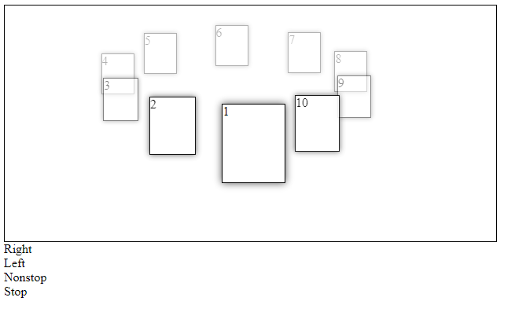

# carusel

Этот плагин предназначен для реализации "карусели" на сайте.

Для работы плfгина создаются глобальные массивы <i>carusels</i> и <i>carusels_timersID</i> . В первом хранятся ссылки на объекты - "карусели" на стренице, в втором - id таймеров <i>setInterval()</i> для работы плагина. 
В объекте <i>carusels[n]</i>, где n - номер очередной "карусели" на странице, хранятся все свойства и методы, необходимые для его работы:
<ul>
<li>width: ширина блока, в котором хрянтся элементы - "карусели";</li>
<li>height: соответствующая высота;</li>
<li>num: количество элемнтов "карусели";</li>
<li>radiusX: радиус движения по оси Х;</li>
<li>radiusY: радиус движения по оси Y;</li>
<li>step: шаг, с которым будут располагаться элементы на окружности;</li>
<li>angl: начальный угол;</li>
<li>angl_road: "добавочный" угол;</li>
<li>members: ссылки на все элементы "карусели";</li>
<li>drow: метод, рассчитывающий положение элементов;</li>
<li>change: логическая переменная, отвечающая за разрешение изменения положения элементов;</li>
<li>counter_start: начальное положение счетчика;</li>
<li>counter_end: конечное положение счетчика;</li>
<li>change_step: шаг, с которым будут передвигаться элементы по окружности;</li>
<li>nonstop: логическая переменная, отвечающая за разрешение передвигать элементы независимо от началього и конечного положения счетчиков;</li>
<li>carusels_right: метод, передвигающий все элементы вправо на определённый шаг;</li>
<li>carusels_left: метод, передвигающий все элементы влево на определённый шаг;</li>
<li>carusels_nonstop: метод, запускающий "карусель";</li>
<li>carusels_stop: метод, останавливаюзий "карусель";</li>
</ul>
Обратите внимание: первые 8 свойств можно задать вручную, как будет нужно. В противном случае значения этих свойств рассчитается автоматически.
Контактный электронный адрес: <a href="mailto:ivan-753s@mail.ru">ivan-753s@mail.ru</a> .
 
 
<h3>In English</h3>

This plugin is designed to implement the "carousel" on the site.

For the operation of the plugin, global arrays <i> carusels </i> and <i> carusels_timersID </i> are created. The first one contains references to objects - "carousels" on the page, in the second - the id of the <i> setInterval () </i> timers for the plugin operation.  
In the <i> carusels[n] </i> object, where n is the number of the next "carousel" on the page, all the properties and methods necessary for its operation are stored:
<ul>
<li> width: the width of the block in which the items are hurled - "carousels" </li>
<li> height: corresponding height; </li>
<li> num: the number of "carousel" elements; </li>
<li> radiusX: radius of movement along the x-axis; </li>
<li> radiusY: radius of movement along the y-axis; </li>
<li> step: the step with which the elements on the circle will be placed; </li>
<li> angl: starting angle; </li>
<li> angl_road: "extra" angle; </li>
<li> members: links to all elements of the carousel;</li>
<li> drow: A method that calculates the position of elements;</li>
<li> change: the logical variable responsible for allowing the position of the elements to change; </li>
<li> counter_start: the initial position of the counter; </li>
<li> counter_end: the end position of the counter; </li>
<li> change_step: the step with which the elements will move around the circle </li>
<li> nonstop: A boolean variable that is responsible for allowing you to move items regardless of the start and end position of the counters;</li>
<li> carusels_right: A method that moves all items to the right for a certain step;</li>
<li> carusels_left: A method that moves all items to the left for a certain step;</li>
<li> carusels_nonstop: the method that starts the "carousel" </li>
<li> carusels_stop: method, stopping the "carousel" .</li>
</ul>
Note: the first 8 properties can be set manually, as it will be necessary. Otherwise, the values ​​of these properties will be calculated automatically.
Contact email: <a href="mailto:ivan-753s@mail.ru"> ivan-753s@mail.ru </a>.
